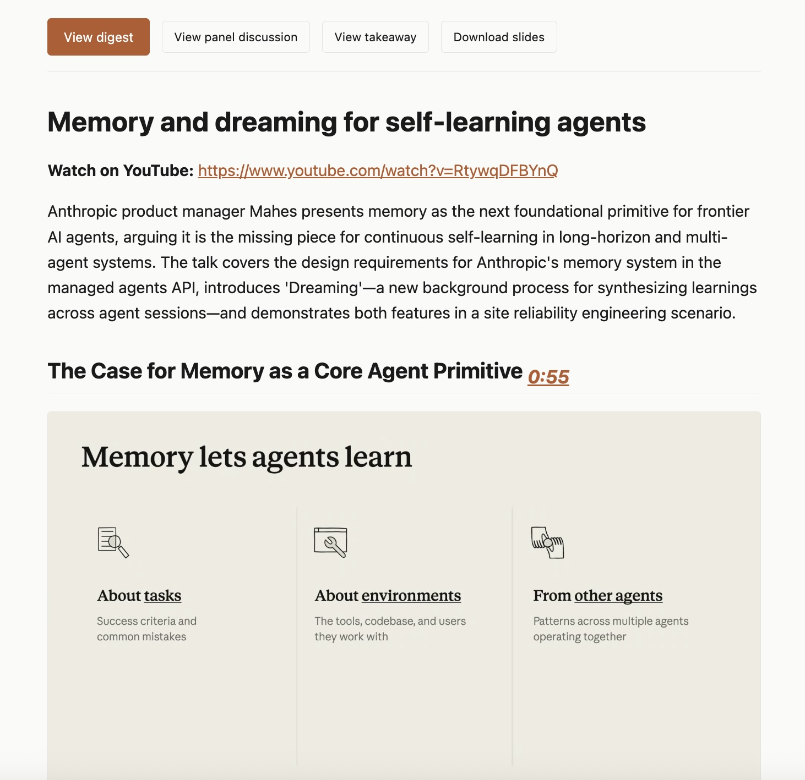
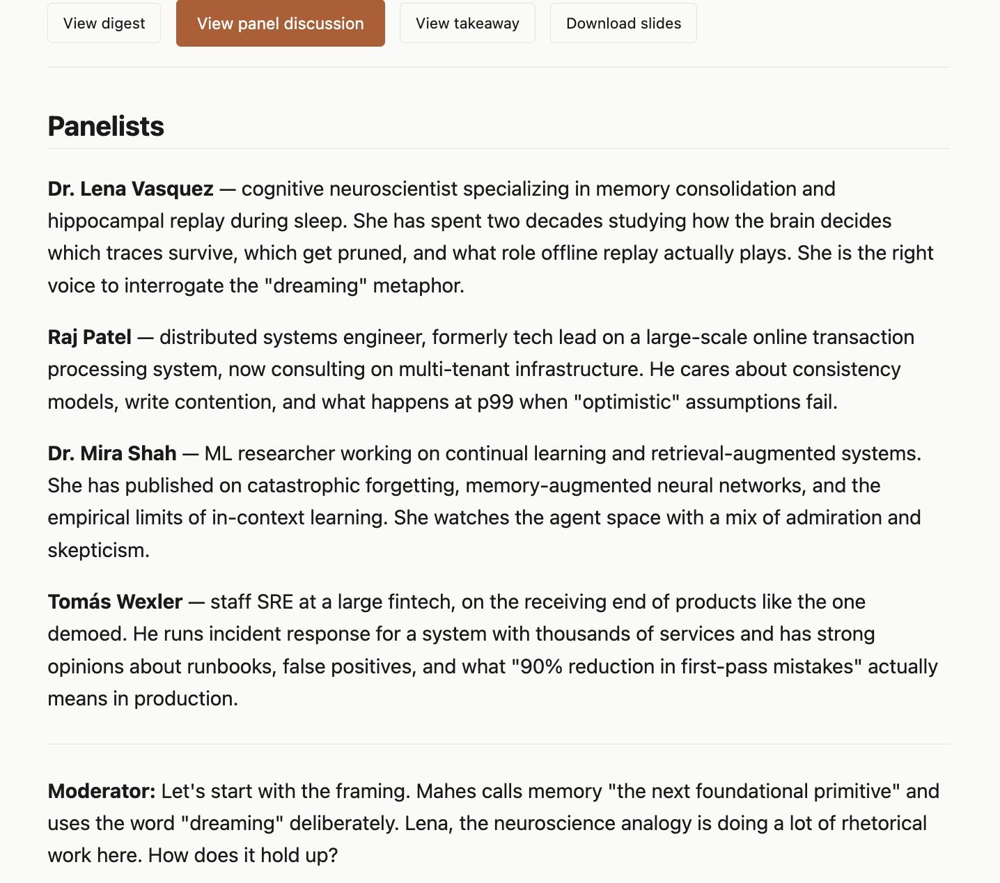
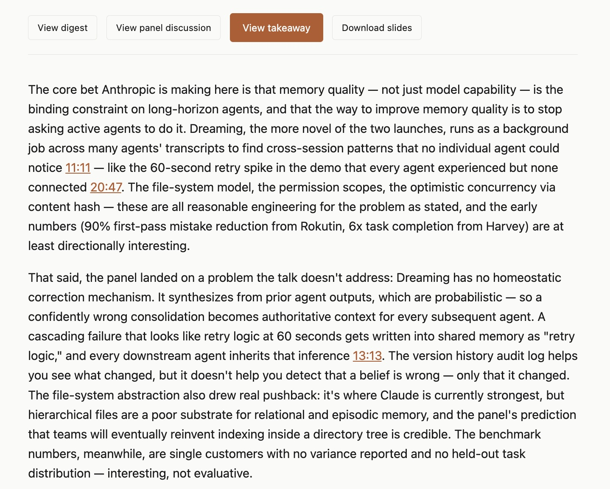

# yt2md — Read YouTube without watching

A local web app that turns long YouTube videos into something you can
actually consume in a few minutes. Paste a URL or subscribe to channels;
yt2md downloads the video, transcribes it, and generates four useful
artifacts for each one — accessible from a tab-bar at the top of every
page:

### Digest

Topic-segmented summary of what the video says, with the most
representative slide / frame embedded under each topic. Click any
timestamp to jump straight to that moment in the original video.



### Panel discussion

A 1500–2500 word multi-perspective critique. Three to five domain
experts (chosen for the video's actual subject — a neuroscientist for a
brain talk, an SRE for an operations talk, etc.) push back on what the
speaker glossed over, bring contrary readings, and connect to adjacent
ideas.



### Takeaway

A 1–3 paragraph synthesis written like a friend telling you what they
got out of the talk. Integrates the panel's pushback into a single
bottom-line read, with inline timestamp links to specific moments
worth verifying.



### Slides

A clean PowerPoint deck reconstructing the speaker's actual
presentation. Vision models filter raw frames down to real deck slides
(no talking-head shots, no animation halves), so a 25-minute talk
becomes ~25–40 slides instead of hundreds of stills.

---

Everything runs on your machine — your videos, your transcripts, your
markdown. The only thing that leaves is the prompts sent to Claude.

---

## Get it running

One command for your platform:

**macOS** — needs [Homebrew](https://brew.sh):

```bash
curl -fsSL https://raw.githubusercontent.com/jyouturner/youtube-to-markdown/main/install.sh | bash
```

**Windows 10/11** — uses winget (built into Windows; install "App
Installer" from the Microsoft Store if it's not on the box yet):

```powershell
irm https://raw.githubusercontent.com/jyouturner/youtube-to-markdown/main/install.ps1 | iex
```

The installer installs `ffmpeg`, `node`, and `uv` via your platform's
package manager if you don't already have them, then installs `yt2md`
itself. Re-run it any time to upgrade. ([See the Mac
script](install.sh) · [See the Windows script](install.ps1))

> **Windows note:** Windows support is currently untested — code paths
> are platform-aware but no one's verified end-to-end on a real Windows
> box. If something breaks, please open an issue.

Then start the app:

```bash
yt2md serve
```

That opens [http://localhost:7682](http://localhost:7682) in your
browser. The first time you load it, you'll land on a setup page to
configure auth — pick one of:

- **API key (simpler, pay-per-call).** Sign in to
  [console.anthropic.com/settings/keys](https://console.anthropic.com/settings/keys),
  add a payment method, paste the key. Typical cost ~$0.20 per 25-min
  video.
- **Claude.ai Pro/Max via Claude Code.** Click "Install Claude Code"
  and yt2md sets up a sandboxed copy on your Mac. No per-call billing —
  usage counts against your plan's rate limits.

---

## Once it's running

The sidebar has two sections:

- **Digests** (top) — every video you've ever processed. Click any one to
  read it. Unread digests get a small dot.
- **Manage** (bottom, always visible) — Subscriptions, One-off digest,
  Schedule, Activity, Settings.

To process a video:

- **One-off** — paste a YouTube URL into the One-off digest page. The
  whole pipeline runs in the background (5–10 minutes for a typical
  video). You can close the tab; come back later. Activity will show you
  when it's done.
- **Subscriptions** — add a YouTube channel (paste the channel URL or
  `@handle`). New videos from that channel get auto-digested in the
  background according to your Schedule (default: every 6 hours).

When you click on a digest, the page has a tab-bar:
**View digest · View panel · View takeaway · Download slides**. The
button for the page you're on is highlighted. If an artifact didn't
generate (rare — happens when an LLM call fails mid-pipeline), the
button shows "Generate X" instead and you can retry with one click.

There's also a **Continue in chat** button on the takeaway page. It
copies the digest + panel + takeaway to your clipboard and opens
claude.ai in a new tab — paste, and you're in a fresh chat with full
context. Useful when you finish reading and have a follow-up question.

---

## Talk to your library from Claude (MCP)

yt2md exposes its library as an MCP server, so Claude Desktop / Claude
Code can read, search, ingest, and trigger generation against your local
digests without a browser.

**Claude Desktop** — add to
`~/Library/Application Support/Claude/claude_desktop_config.json`:

```json
{
  "mcpServers": {
    "yt2md": {
      "command": "yt2md",
      "args": ["mcp"]
    }
  }
}
```

**Claude Code** — one command:

```bash
claude mcp add yt2md -- yt2md mcp
```

Restart the client. Once connected, the agent has these tools:

| Tool | What it does |
| --- | --- |
| `list_digests` | Browse the library (filters: channel, since-date, unread, title query) |
| `read_digest` | Read a specific section: overview, a topic, the panel, a single panel turn, the takeaway, or the full digest |
| `search_library` | Substring search across digest + panel + takeaway with scored snippets |
| `digest_video` | Ingest a YouTube URL (skips if already digested) |
| `generate_panel` / `generate_takeaway` / `generate_slides` | Backfill missing artifacts |
| `job_status` | Poll a background generation job |
| `list_subscriptions` / `add_subscription` / `remove_subscription` | Manage watched channels |

Reads are structured JSON (not markdown). The agent does the formatting
for chat, so you can ask things like *"summarize the panel's pushback
in the Salesforce digest"* or *"what have I read this month about
distributed systems?"* without yt2md guessing what format you want.

The same surface is available from the shell, so cron / Claude Desktop's
schedule feature / any script can drive the library too:

```bash
yt2md list --unread --since 2026-05-01 --json    # browse
yt2md read <video-id> --section takeaway --json  # read a slice
yt2md search "agent pricing" -k 5                # search
yt2md digest "https://youtu.be/..." --wait       # ingest (blocking)

yt2md topics                                     # taxonomy across library
yt2md list --topic ai-policy                     # filter by tag
yt2md list --saved                               # only digests you saved
yt2md retrofit-topics --dry-run                  # tag old digests (Haiku)
```

### Topic tags + curation

Each digest gets 2-5 topic tags from a Haiku call after generation
(reuses the existing taxonomy where possible, marks new tags so you can
spot vocabulary drift). On top of those, you (or the agent) can add
user-tags, save, or dismiss digests:

- `tag_digest(id, [tags])` / `untag_digest(id, [tags])` — user tags are
  kept separate from LLM tags; the LLM never overwrites yours.
- `save_digest(id)` / `unsave_digest(id)` — for things worth returning to.
- `dismiss_digest(id)` / `undismiss_digest(id)` — hidden from default
  briefings.
- `list_topics()` — taxonomy with counts, grounding the LLM's tagging
  prompt on each new digest.
- Filters compose on `list_digests`: `topic`, `source`
  (`subscription` / `oneoff` / `meta`), `saved`, `dismissed`.

Backfill the topic layer for existing digests:

```bash
yt2md retrofit-topics --dry-run     # see what would be tagged
yt2md retrofit-topics               # actually do it (~$0.001/digest)
```

---

## What it costs

You can see your actual spend on the **Activity** page —
today / 7d / 30d / all-time, plus per-run cost in the table. Every LLM
call gets logged with tokens and dollar estimate.

Rough numbers for a 25-minute slide-heavy tech talk with the default
models (Sonnet 4.6 + Opus 4.7):

| Step | What it does | Cost |
| --- | --- | --- |
| Digest | Topic segmentation | ~$0.06 |
| Vision frame-picking | Picks one frame per topic | ~$0.13 |
| Panel discussion | Opus, multi-expert critique | ~$0.58 |
| Takeaway | Synthesis prose | ~$0.06 |
| Slide classifier | Filters frames to real slides | ~$0.01 |
| **Total** | | **~$0.84** |

Subscription users (Claude Code path): no per-call dollars, but each
generation step counts against your plan's rate limits. The Activity
page tags those calls as "subscription" instead of a dollar amount.

Most cost goes to the panel — Opus is expensive but produces the
deepest critique. You can swap to Sonnet for the panel in Settings if
you want to cut cost roughly in half.

---

## Where your data lives

Everything stays on your machine, under `~/yt2md/`:

- `~/yt2md/.env` — your Anthropic credentials
- `~/yt2md/settings.json` — model preferences, language, cookies setting
- `~/yt2md/channels.txt` — your subscriptions
- `~/yt2md/digests/<video-id>/` — per-video artifacts:
  - `digest.md` — the reading
  - `panel.md` — the panel discussion
  - `takeaway.md` — the bottom-line synthesis
  - `slides.pptx` — the reconstructed deck
  - `digest_images/` — frames embedded in the markdown
  - `downloads/` — cached video + transcript (used by regeneration; can
    be deleted to reclaim space)
- `~/yt2md/logs/` — job output and the LLM usage log (for the cost audit)
- `~/yt2md/library.db` — read-state and run history (SQLite)

Override the location by setting `YT2MD_DATA=/some/path` before launch.

---

## When things go wrong

- **"Sign in to confirm you're not a bot"** from YouTube. Set the
  cookies-from-browser option in Settings to whichever browser you're
  signed into YouTube on. yt-dlp will pass those cookies through.
- **A video has no captions and Whisper takes forever.** Whisper
  transcription on the local machine can take 5–10 minutes for a long
  video. The default model (`medium`) is a balance; pick `small` in
  Settings if you want faster (slightly less accurate) transcription.
- **Frame extraction is slow** (5+ minutes on a 25-minute video). This
  is normal for a slide-heavy talk — ffmpeg has to decode the whole
  video. The job runs in the background; you can navigate away.
- **An artifact didn't generate.** The auto-pipeline catches transient
  failures (rate limits, network blips) and continues with the next
  step. Open the digest's page; the missing artifact will show a
  `Generate X` button. One click retries that step in the background.
- **First run on a new channel doesn't backfill.** Only videos posted
  *after* you subscribe get digested. Use One-off for videos you want
  from before you added the channel.

---

## What this isn't

- **It's not a chat tool.** The reading-and-distillation pipeline is the
  product. If you want to ask follow-up questions, the "Continue in
  chat" button hands you off to claude.ai — yt2md doesn't try to
  duplicate Claude.
- **It's not a cloud service.** You install it locally because YouTube
  blocks datacenter IPs from downloading videos. Side benefit: your
  reading library never leaves your Mac.
- **It's not for live videos.** Streams have to be finalized for
  yt-dlp to pull them.

---

## Build from source (developers)

If you want to modify the source instead of just running yt2md:

```bash
git clone https://github.com/jyouturner/youtube-to-markdown
cd youtube-to-markdown
./run.sh
```

`run.sh` checks ffmpeg, installs uv if missing, syncs dependencies, and
launches the reader from the local checkout. Edits to
`youtube_to_markdown.py` are picked up on the next `./run.sh`.

Uninstall the curl-bash install with `uv tool uninstall youtube-to-markdown`.
